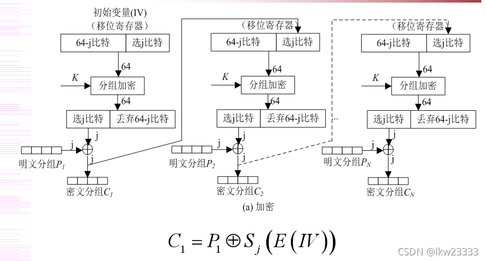
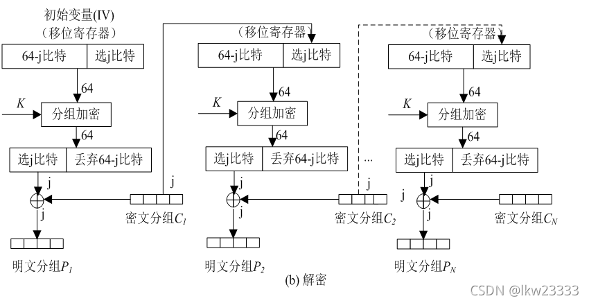

>  ​	CFB模式的全称是Cipher Feedback模式，中文翻译为密码反馈。该模式的主要特点是：
>
> 1. 明文本身不参与加密运算，而是由初使化向量或前面分组产生的密文进行加密运算，再次产生密文序列。
>2. 用第1步产生的密文序列和明文分组做XOR运算，产生本分组的真正密文。

## 加密过程



## 解密过程



## 重放攻击

```
hgame2020-week3-Feedback
```

