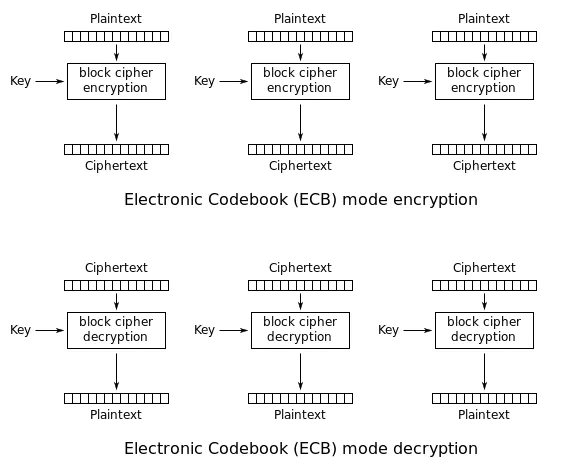

>​	ECB模式的全称是Electronic CodeBook模式，中文翻译为电子密码本。该模式的主要特点是将明文按分组的长度进行分割，然后对分割的明文进行单独的加密运算，每个分割的明文之间互不影响，因而加密速度较快，并且支持在多核环境下的并行计算。但是这种方法一旦有一个块被破解，使用相同的方法可以解密所有的明文数据，安全性比较差。


## 加解密过程



## 代换攻击

```
2019OGeek-Babycry
```

